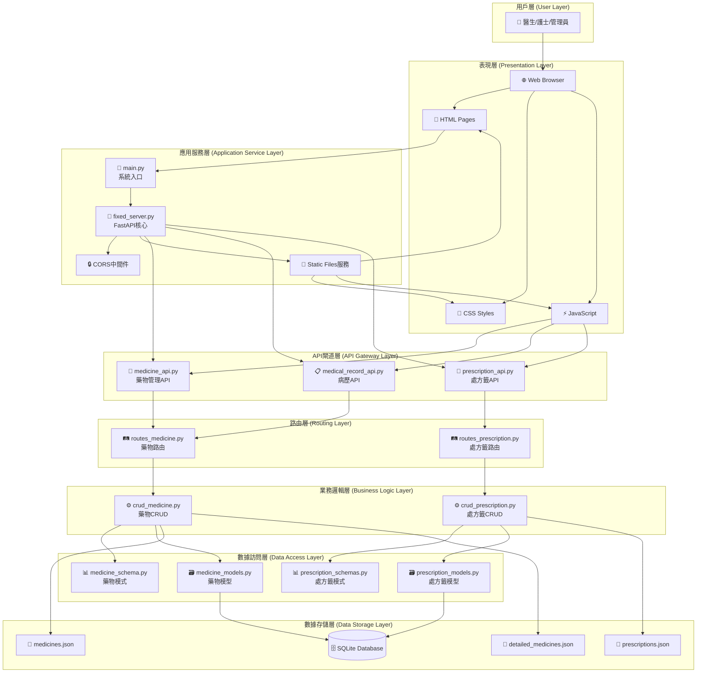
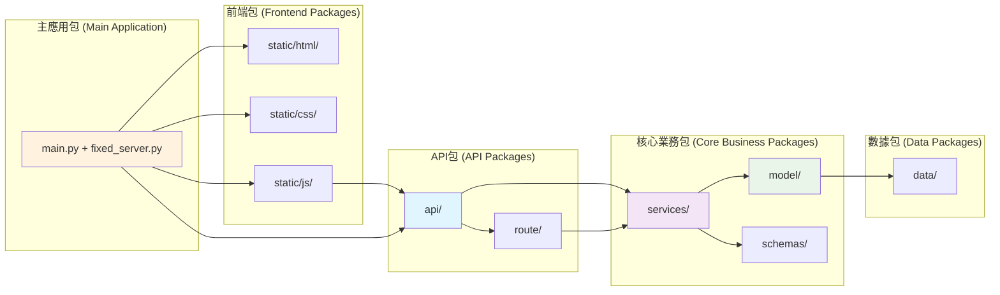
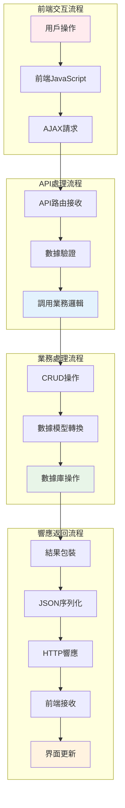
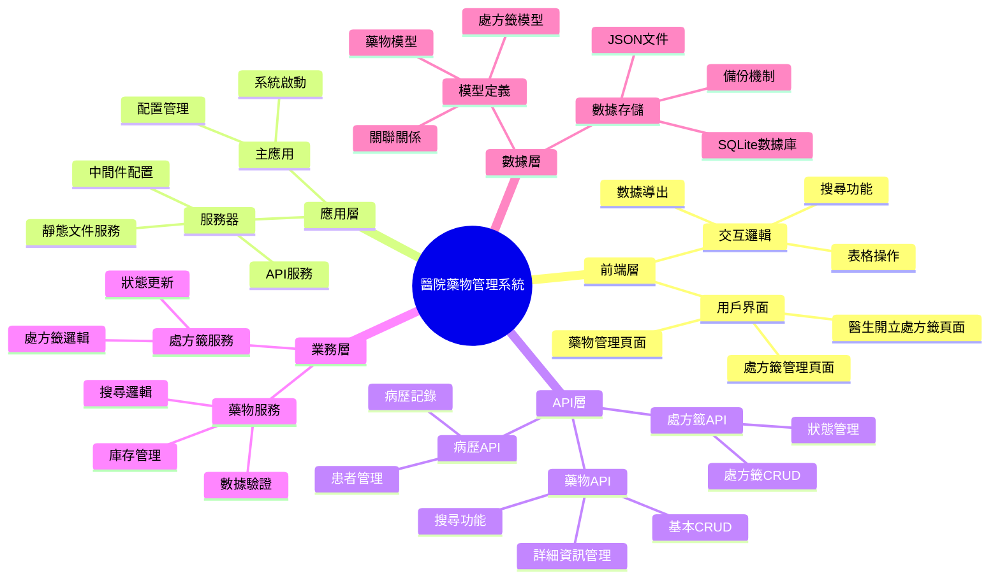
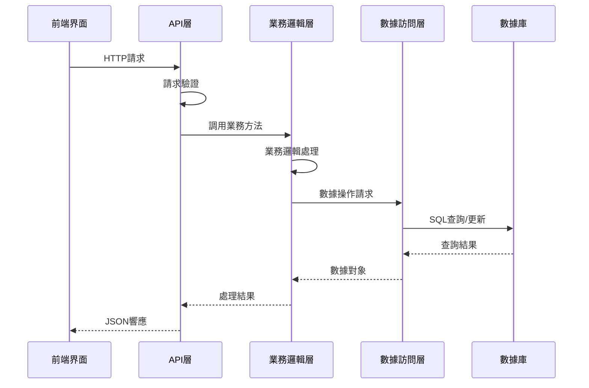
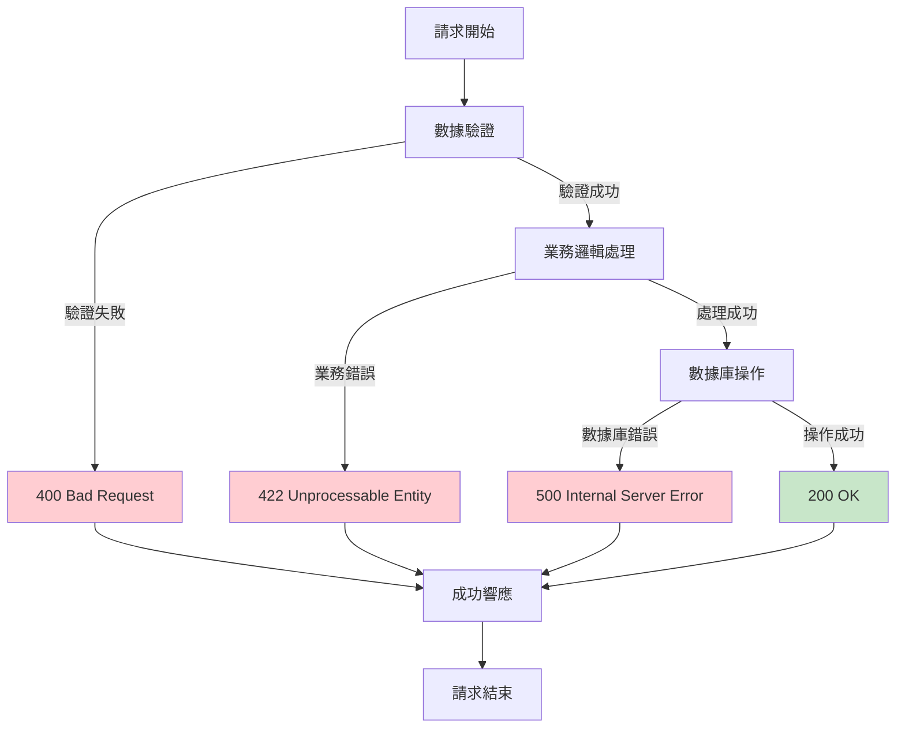
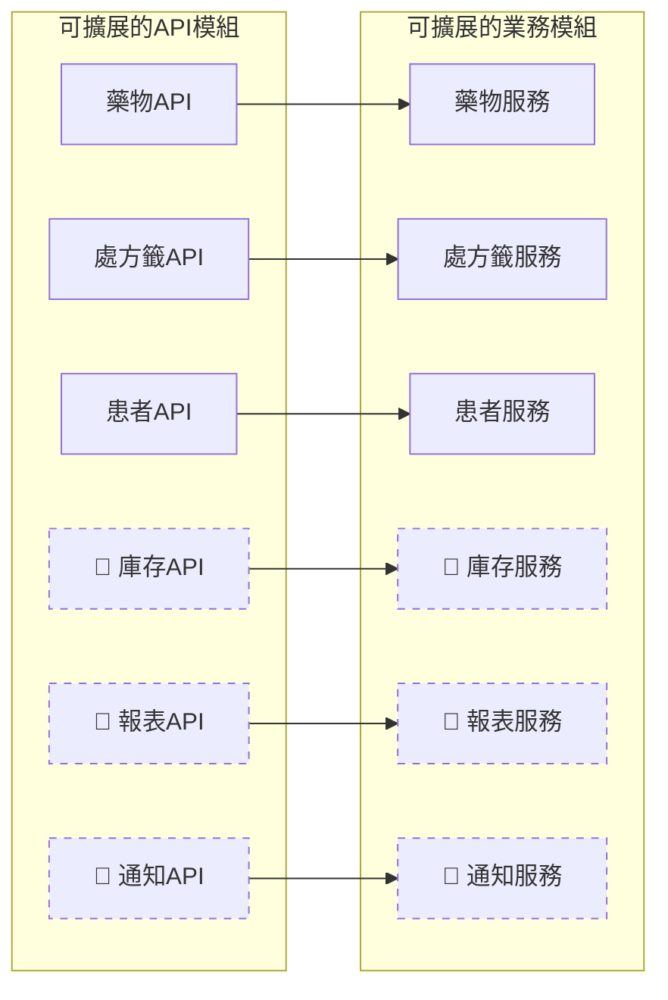
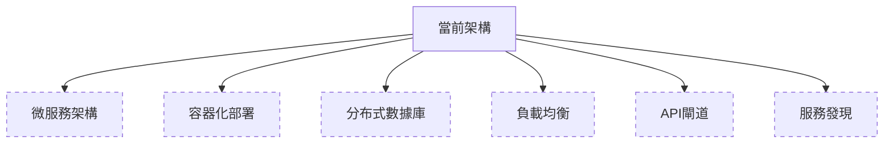

# 醫院藥物管理系統 - 架構圖說明

## 🏛️ 系統整體架構圖



## 📦 包依賴關係圖



## 🔄 數據流向圖



## 📋 模組職責分工圖



## 🎯 分層架構詳解

### 1. 表現層 (Presentation Layer)
```
📱 用戶界面層
├── 🌐 Web瀏覽器
├── 📄 HTML模板 (static/html/)
├── 🎨 CSS樣式 (static/css/)
└── ⚡ JavaScript邏輯 (static/js/)
```
**職責**: 用戶交互、數據展示、前端驗證

### 2. 應用服務層 (Application Service Layer)
```
🚀 應用程式層
├── 🔧 main.py (系統入口)
├── 🛠️ fixed_server.py (FastAPI核心)
├── 🔒 中間件配置 (CORS等)
└── 📁 靜態文件服務
```
**職責**: 應用程式啟動、全局配置、請求分發

### 3. API閘道層 (API Gateway Layer)
```
🌐 API閘道層
├── 💊 medicine_api.py (藥物管理)
├── 📋 medical_record_api.py (病歷管理)
└── 📝 prescription_api.py (處方籤管理)
```
**職責**: API端點定義、請求路由、響應格式化

### 4. 業務邏輯層 (Business Logic Layer)
```
⚙️ 業務邏輯層
├── 🔨 crud_medicine.py (藥物業務邏輯)
└── 🔨 crud_prescription.py (處方籤業務邏輯)
```
**職責**: 核心業務邏輯、數據處理、業務規則驗證

### 5. 數據訪問層 (Data Access Layer)
```
📊 數據訪問層
├── 🗃️ models/ (數據模型)
│   ├── medicine_models.py
│   └── prescription_models.py
└── 📋 schemas/ (API模式)
    ├── medicine_schema.py
    └── prescription_schemas.py
```
**職責**: 數據模型定義、ORM映射、數據驗證

### 6. 數據存儲層 (Data Storage Layer)
```
🗄️ 數據存儲層
├── 📘 SQLite資料庫
└── 📄 JSON文件存儲
    ├── medicines.json
    ├── detailed_medicines.json
    └── prescriptions.json
```
**職責**: 數據持久化、數據備份、數據恢復

## 🔗 包間通信協議

### API調用流程


### 錯誤處理流程


## 📈 擴展性設計

### 水平擴展點


### 垂直擴展點


## 🎯 總結

這個架構設計具有以下特點：

### ✅ 優勢
1. **分層清晰**: 每層職責明確，易於維護
2. **低耦合**: 層間依賴關係簡單，易於測試
3. **高內聚**: 同層模組功能相關性強
4. **可擴展**: 易於添加新功能和新模組
5. **標準化**: 遵循RESTful API設計原則

### 🔧 技術亮點
1. **FastAPI**: 現代Python Web框架
2. **SQLModel**: 類型安全的ORM
3. **Pydantic**: 數據驗證和序列化
4. **分層架構**: 清晰的職責分離
5. **模組化設計**: 易於維護和擴展

### 🚀 未來擴展方向
1. **微服務架構**: 將各模組拆分為獨立服務
2. **容器化部署**: 使用Docker進行部署
3. **API閘道**: 統一API管理和安全控制
4. **分布式存儲**: 支持更大規模的數據處理
5. **實時通知**: 添加WebSocket支持實時更新