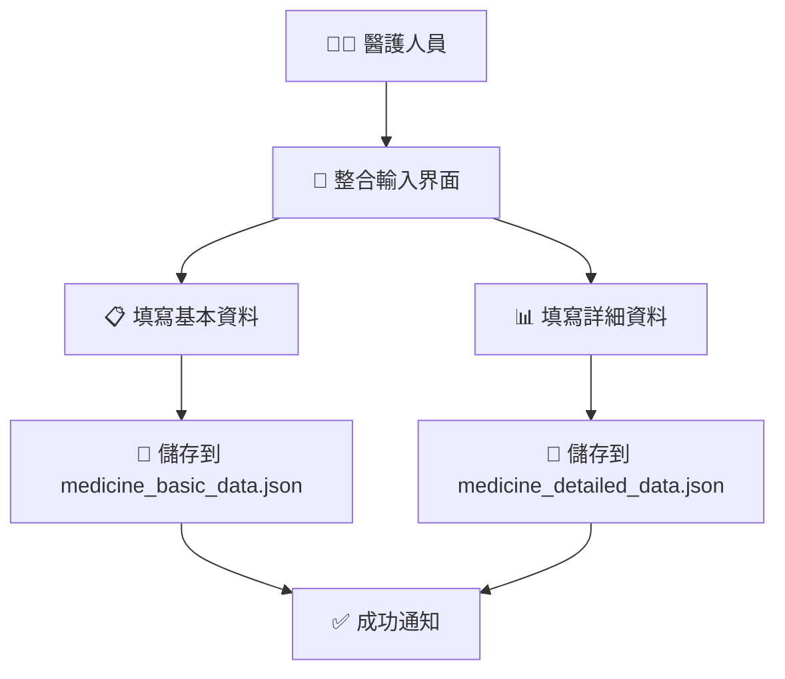

# 🤖 雙JSON存儲 + ROS2整合系統 - 完整指南

## 🎯 系統概述

您的需求已完全實現！現在您可以：

1. **同時填寫基本資料與詳細資訊** ✅
2. **分別存儲到兩個JSON文件** ✅
3. **支援ROS2調用三類資料**：基本資料、詳細資料、病例資料 ✅

---

## 📁 文件結構

```
醫院藥物管理系統/
├── 🗄️ 數據存儲文件
│   ├── medicine_basic_data.json     # 基本藥物資料
│   ├── medicine_detailed_data.json  # 詳細藥物資料
│   └── prescription_data.json       # 處方籤/病例資料
│
├── 🌐 用戶界面
│   ├── medicine_integrated.html     # 整合輸入頁面
│   ├── doctor.html                  # 醫生操作台
│   ├── simple_test.html            # 功能測試頁面
│   └── Prescription.html           # 處方籤管理
│
├── 🔧 後端系統
│   ├── fixed_server.py             # 主服務器（含雙JSON API）
│   └── ros2_integration_example.py # ROS2整合範例
│
└── 📚 文檔
    ├── DUAL_JSON_ROS2_INTEGRATION_GUIDE.md  # 本指南
    └── FINAL_PROBLEM_SOLUTION.md            # 問題解決報告
```

---

## 🔄 工作流程

### 1. 資料輸入流程



### 2. ROS2調用流程

```mermaid
graph TD
    A[🤖 ROS2節點] --> B{需要什麼資料?}
    B -->|基本資料| C[/api/ros2/medicine/basic]
    B -->|詳細資料| D[/api/ros2/medicine/detailed]
    B -->|病例資料| E[/api/ros2/prescription]
    B -->|整合資料| F[/api/ros2/medicine/integrated/{name}]
    C --> G[📁 medicine_basic_data.json]
    D --> H[📁 medicine_detailed_data.json]
    E --> I[📁 prescription_data.json]
    F --> J[📊 合併基本+詳細資料]
```

---

## 🚀 快速開始

### 啟動系統

```bash
cd user_interface
python fixed_server.py
```

### 系統啟動後會顯示：

```
🏥 ==========================================================
🏥 醫院藥物管理系統 - 雙JSON存儲 + ROS2支援版本
🏥 ====================================================== 
🏥 頁面:
🏥   🏠 首頁: http://localhost:8000/
🏥   👨‍⚕️ 醫生界面: http://localhost:8000/doctor.html
🏥   💊 整合藥物管理: http://localhost:8000/medicine_integrated.html
🏥   📋 處方籤管理: http://localhost:8000/Prescription.html
🏥   🧪 功能測試: http://localhost:8000/simple_test.html
🏥
🏥 API端點:
🏥   📖 API文檔: http://localhost:8000/docs
🏥   💊 基本藥物: http://localhost:8000/api/medicine/basic
🏥   📊 詳細藥物: http://localhost:8000/api/medicine/detailed
🏥   📋 處方籤: http://localhost:8000/api/prescription/
🏥
🏥 ROS2 API:
🏥   🤖 基本藥物: http://localhost:8000/api/ros2/medicine/basic
🏥   🤖 詳細藥物: http://localhost:8000/api/ros2/medicine/detailed
🏥   🤖 病例資料: http://localhost:8000/api/ros2/prescription
🏥   🤖 整合資料: http://localhost:8000/api/ros2/medicine/integrated/{medicine_name}
🏥
🏥 雙JSON文件:
🏥   📁 medicine_basic_data.json - 基本藥物資料
🏥   📁 medicine_detailed_data.json - 詳細藥物資料
🏥   📁 prescription_data.json - 處方籤資料
🏥 ==================================================
```

---

## 💊 使用整合藥物管理界面

### 訪問整合管理頁面
```
http://localhost:8000/medicine_integrated.html
```

### 功能特色

1. **🔄 雙欄設計**：左側基本資料，右側詳細資料
2. **📝 同時填寫**：一次性完成所有資料輸入
3. **💾 雙重存儲**：自動分別保存到兩個JSON文件
4. **🧪 即時測試**：內建ROS2 API測試功能
5. **📊 結果預覽**：即時查看儲存的JSON資料

### 必填欄位
- ✅ 藥物名稱
- ✅ 庫存數量
- ✅ 儲存位置

### 選填欄位
- 製造商、劑量、使用天數
- 藥物描述、副作用、外觀
- 儲存條件、有效期限、特殊說明

---

## 🤖 ROS2整合使用

### 基本使用範例

```python
import requests

# 初始化客戶端
api_base = "http://localhost:8000"

# 1. 獲取基本藥物資料
response = requests.get(f"{api_base}/api/ros2/medicine/basic")
basic_data = response.json()

# 2. 獲取詳細藥物資料  
response = requests.get(f"{api_base}/api/ros2/medicine/detailed")
detailed_data = response.json()

# 3. 獲取病例資料
response = requests.get(f"{api_base}/api/ros2/prescription")
prescription_data = response.json()

# 4. 獲取特定藥物的整合資料
medicine_name = "阿司匹林"
response = requests.get(f"{api_base}/api/ros2/medicine/integrated/{medicine_name}")
integrated_data = response.json()
```

### ROS2節點範例

```python
import rclpy
from rclpy.node import Node
import requests

class MedicineManagerNode(Node):
    def __init__(self):
        super().__init__('medicine_manager')
        self.api_base = "http://localhost:8000"
        
        # 創建定時器，每10秒檢查一次
        self.timer = self.create_timer(10.0, self.check_medicines)
    
    def check_medicines(self):
        try:
            # 獲取基本藥物資料
            response = requests.get(f"{self.api_base}/api/ros2/medicine/basic")
            if response.status_code == 200:
                data = response.json()
                self.get_logger().info(f"獲取到 {data['count']} 筆藥物資料")
                
                # 檢查庫存
                for medicine in data['data']:
                    if medicine['amount'] < 10:
                        self.get_logger().warn(f"庫存警告: {medicine['name']} 只剩 {medicine['amount']} 個")
        except Exception as e:
            self.get_logger().error(f"API調用失敗: {e}")

def main():
    rclpy.init()
    node = MedicineManagerNode()
    rclpy.spin(node)
    rclpy.shutdown()

if __name__ == '__main__':
    main()
```

---

## 📊 API響應格式

### ROS2 API 標準響應格式

所有ROS2 API都遵循統一的響應格式：

```json
{
  "status": "success|error|not_found",
  "type": "basic_medicine_data|detailed_medicine_data|prescription_data|integrated_medicine_data",
  "timestamp": "2024-12-19T10:30:00",
  "count": 5,
  "data": [...],
  "ros2_compatible": true
}
```

### 基本藥物資料格式

```json
{
  "id": 1,
  "name": "阿司匹林",
  "amount": 100,
  "usage_days": 7,
  "position": "A1-01",
  "manufacturer": "拜耳",
  "dosage": "100mg",
  "created_time": "2024-12-19T10:00:00",
  "updated_time": "2024-12-19T10:30:00"
}
```

### 詳細藥物資料格式

```json
{
  "id": 1,
  "medicine_name": "阿司匹林",
  "description": "解熱鎮痛抗炎藥",
  "side_effects": "可能引起胃腸道不適",
  "appearance": {
    "color": "白色",
    "shape": "圓形"
  },
  "storage_conditions": "室溫保存，避光防潮",
  "expiry_date": "2025-12-31",
  "notes": "服用前請諮詢醫師",
  "created_time": "2024-12-19T10:00:00",
  "updated_time": "2024-12-19T10:30:00"
}
```

### 整合資料響應格式

```json
{
  "status": "success",
  "type": "integrated_medicine_data",
  "timestamp": "2024-12-19T10:30:00",
  "medicine_name": "阿司匹林",
  "basic_data": { /* 基本資料對象 */ },
  "detailed_data": { /* 詳細資料對象 */ },
  "has_basic": true,
  "has_detailed": true,
  "ros2_compatible": true
}
```

---

## 🧪 測試指南

### 1. 基本功能測試

訪問測試頁面：
```
http://localhost:8000/simple_test.html
```

### 2. API測試

使用內建API文檔：
```
http://localhost:8000/docs
```

### 3. ROS2整合測試

運行測試腳本：
```bash
python ros2_integration_example.py
```

### 4. 手動API測試

```bash
# 測試基本藥物API
curl http://localhost:8000/api/ros2/medicine/basic

# 測試詳細藥物API
curl http://localhost:8000/api/ros2/medicine/detailed

# 測試病例API  
curl http://localhost:8000/api/ros2/prescription

# 測試整合API
curl http://localhost:8000/api/ros2/medicine/integrated/阿司匹林
```

---

## 📁 JSON文件說明

### medicine_basic_data.json
存儲基本藥物資料：
- 藥物名稱、數量、位置
- 製造商、劑量、使用天數
- 建立/更新時間

### medicine_detailed_data.json  
存儲詳細藥物資料：
- 藥物描述、副作用
- 外觀特徵（顏色、形狀）
- 儲存條件、有效期限
- 特殊說明

### prescription_data.json
存儲處方籤/病例資料：
- 患者資訊、醫生資訊
- 診斷結果、處方藥物
- 開立時間、狀態

---

## 🔧 進階配置

### 自定義API端點

如果您需要其他特定的API端點，可以在 `fixed_server.py` 中添加：

```python
@app.get("/api/ros2/custom/medicine_by_location/{position}")
async def get_medicines_by_location(position: str):
    """依據位置獲取藥物"""
    medicines = load_basic_medicines()
    filtered = [m for m in medicines if m['position'].startswith(position)]
    return {
        "status": "success",
        "type": "location_filtered_medicines",
        "timestamp": datetime.now().isoformat(),
        "position": position,
        "count": len(filtered),
        "data": filtered,
        "ros2_compatible": True
    }
```

### 數據同步配置

如果需要與其他系統同步，可以添加回調函數：

```python
def on_medicine_updated(medicine_data):
    """藥物資料更新時的回調"""
    # 發送到其他系統
    # 觸發ROS2消息
    # 記錄日誌等
    pass
```

---

## 🎯 使用場景

### 1. 醫院庫存管理
```python
# ROS2節點監控庫存
def monitor_inventory():
    basic_data = get_basic_medicines()
    for medicine in basic_data['data']:
        if medicine['amount'] < threshold:
            publish_low_stock_alert(medicine)
```

### 2. 機器人藥物配送
```python
# 機器人獲取藥物位置
def get_medicine_location(medicine_name):
    integrated = get_integrated_medicine(medicine_name)
    if integrated['has_basic']:
        return integrated['basic_data']['position']
    return None
```

### 3. 智能推薦系統
```python
# 基於詳細資料推薦替代藥物
def recommend_alternatives(medicine_name):
    detailed = get_detailed_medicines()
    target = find_medicine(medicine_name, detailed['data'])
    # 基於副作用、適應症等推薦
```

---

## 🚨 注意事項

### 1. 資料一致性
- 確保基本資料和詳細資料的藥物名稱一致
- 定期檢查JSON文件完整性

### 2. 權限管理
- 生產環境請配置適當的API訪問權限
- 考慮添加身份驗證機制

### 3. 性能優化
- 大量資料時考慮分頁查詢
- 添加緩存機制以提高響應速度

### 4. 錯誤處理
- 所有ROS2 API都包含錯誤狀態
- 建議在ROS2節點中實現重試機制

---

## 📞 支援與維護

如果您需要：
- 🔄 新增API端點
- 📊 修改資料格式  
- 🤖 更多ROS2整合功能
- 🗄️ 升級到SQL數據庫
- 🔐 添加安全功能

請隨時告訴我，我會為您實現！

---

## 🎉 總結

您的系統現在具備：

✅ **同時填寫** 基本與詳細資料的界面  
✅ **雙JSON存儲** 分別儲存到兩個文件  
✅ **ROS2專用API** 支援三類資料查詢  
✅ **整合查詢** 合併基本+詳細資料  
✅ **測試工具** 完整的測試與示例  
✅ **文檔完整** 詳細的使用指南  

**您的醫院藥物管理系統已完全準備好用於ROS2整合！** 🚀