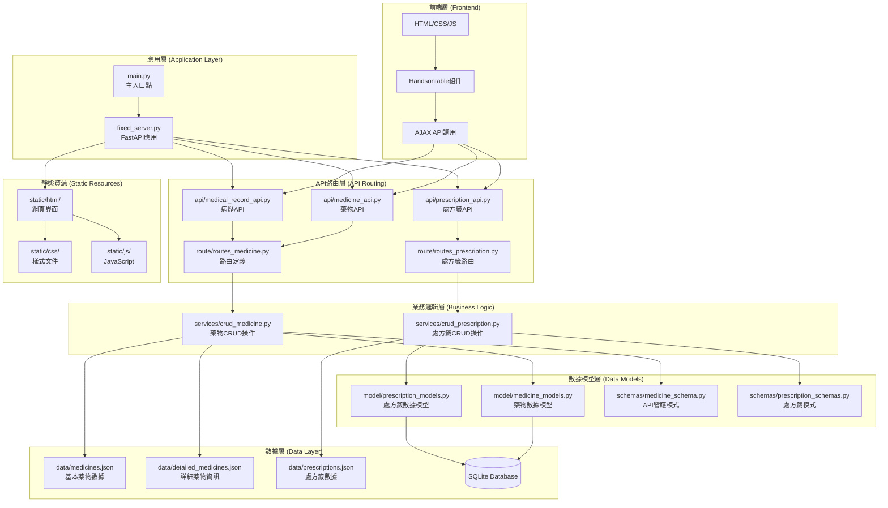
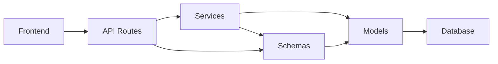
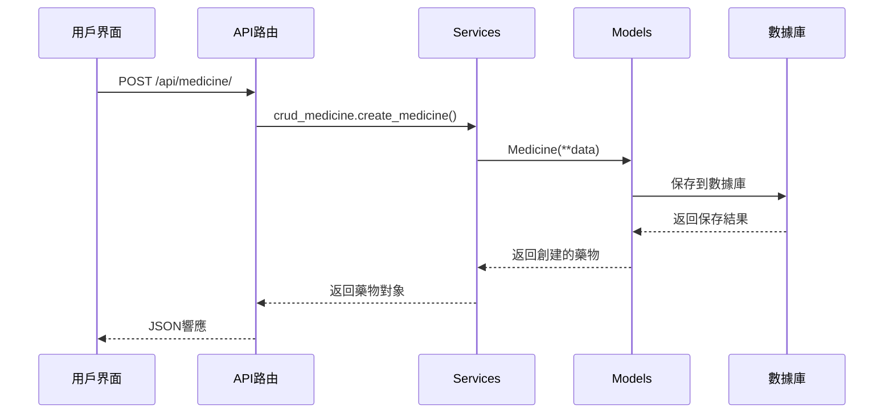
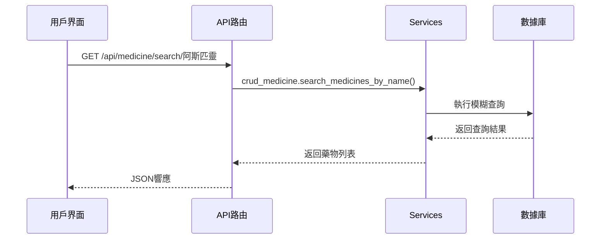

# 醫院藥物管理系統 - 包功能與架構文檔

## 📋 目錄
1. [系統架構概覽](#系統架構概覽)
2. [核心包功能說明](#核心包功能說明)
3. [包之間的關係](#包之間的關係)
4. [API層級結構](#api層級結構)
5. [數據流程圖](#數據流程圖)
6. [使用範例](#使用範例)

---

## 🏗️ 系統架構概覽



---

## 📦 核心包功能說明

### 1. **主應用程式 (Main Application)**
- **`main.py`**: 系統主入口點
  - 功能：啟動FastAPI服務器
  - 導入fixed_server的app實例
  - 配置服務器參數（host, port等）

- **`fixed_server.py`**: 核心FastAPI應用
  - 功能：定義完整的API服務器
  - 包含所有API端點
  - 靜態文件服務
  - CORS中間件配置

### 2. **API層 (API Layer)**

#### **`api/` 包**
```python
api/
├── __init__.py          # 包初始化
├── medicine_api.py      # 藥物管理API
├── medical_record_api.py # 病歷管理API
└── prescription_api.py  # 處方籤API
```

**功能說明：**
- **`medicine_api.py`**: 
  - 藥物的CRUD操作API端點
  - 支援基本藥物和詳細藥物資訊
  - 搜尋和篩選功能
  - JSON/CSV導出功能

- **`medical_record_api.py`**: 
  - 病歷記錄管理
  - 患者資訊CRUD
  - 病歷查詢和統計

- **`prescription_api.py`**: 
  - 處方籤管理
  - 醫生開立處方籤
  - 處方籤狀態追蹤

#### **`route/` 包**
```python
route/
├── routes_medicine.py      # 藥物路由定義
└── routes_prescription.py  # 處方籤路由定義
```

**功能說明：**
- 定義RESTful API路由
- 整合SQLAlchemy數據庫操作
- 請求驗證和響應格式化

### 3. **業務邏輯層 (Business Logic Layer)**

#### **`services/` 包**
```python
services/
├── crud_medicine.py      # 藥物CRUD服務
└── crud_prescription.py  # 處方籤CRUD服務
```

**功能說明：**
- **`crud_medicine.py`**:
  ```python
  # 主要功能
  - create_medicine()      # 創建藥物
  - get_medicine_by_name() # 根據名稱查詢
  - search_medicines()     # 模糊搜尋
  - get_all_medicines()    # 獲取所有藥物
  - update_medicine()      # 更新藥物資訊
  - delete_medicine()      # 刪除藥物
  ```

- **`crud_prescription.py`**:
  ```python
  # 主要功能
  - create_prescription()  # 創建處方籤
  - get_prescriptions()    # 獲取處方籤列表
  - update_prescription()  # 更新處方籤狀態
  - delete_prescription()  # 刪除處方籤
  ```

### 4. **數據模型層 (Data Models Layer)**

#### **`model/` 包**
```python
model/
├── medicine_models.py      # 藥物數據模型
└── prescription_models.py  # 處方籤數據模型
```

**功能說明：**
- **`medicine_models.py`**:
  ```python
  class Medicine(SQLModel, table=True):
      id: Optional[int] = Field(primary_key=True)
      name: str                    # 藥物名稱
      amount: int                  # 庫存數量
      usage_days: int              # 使用天數
      position: str                # 儲存位置
      create_time: datetime        # 建立時間
  
  class InventoryLog(SQLModel, table=True):
      id: Optional[int] = Field(primary_key=True)
      medicine_id: int             # 藥物ID
      change: int                  # 庫存變化
      timestamp: datetime          # 時間戳
  ```

#### **`schemas/` 包**
```python
schemas/
├── medicine_schema.py      # 藥物API模式
└── prescription_schemas.py # 處方籤API模式
```

**功能說明：**
- **API請求/響應數據驗證**
- **數據序列化/反序列化**
- **類型安全保證**

**範例：**
```python
# medicine_schema.py
class MedicineCreate(SQLModel):    # POST請求模式
    name: str
    amount: int
    usage_days: int
    position: str

class MedicineRead(SQLModel):      # GET響應模式
    id: int
    name: str
    amount: int
    usage_days: int
    position: str
    create_time: datetime

class MedicineUpdate(SQLModel):    # PUT/PATCH請求模式
    name: Optional[str] = None
    amount: Optional[int] = None
    usage_days: Optional[int] = None
    position: Optional[str] = None
```

### 5. **數據存儲層 (Data Storage Layer)**

#### **`data/` 包**
```python
data/
├── medicines.json            # 基本藥物數據
├── detailed_medicines.json   # 詳細藥物資訊
├── prescriptions.json        # 處方籤數據
└── prescription_status.json  # 處方籤狀態
```

**功能說明：**
- **JSON文件持久化存儲**
- **數據備份和恢復**
- **系統初始化數據**

### 6. **前端資源層 (Frontend Resources)**

#### **`static/` 包**
```python
static/
├── html/
│   ├── Medicine.html        # 藥物管理界面
│   ├── Prescription.html    # 處方籤管理界面
│   └── doctor.html          # 醫生開立處方籤界面
├── css/
│   ├── unified_style.css    # 統一樣式文件
│   ├── medicine.css         # 藥物頁面樣式
│   └── doctor_style.css     # 醫生頁面樣式
└── js/
    ├── medicine.js          # 藥物管理JavaScript
    ├── doctor.js            # 醫生界面JavaScript
    └── Prescription.js      # 處方籤JavaScript
```

---

## 🔄 包之間的關係

### 數據流程關係
```
用戶操作 → 前端界面 → AJAX請求 → API路由 → 業務邏輯 → 數據模型 → 數據庫
```

### 依賴關係


### 包導入關係
```python
# API層導入
from services import crud_medicine
from schemas.medicine_schema import MedicineCreate
from model import medicine_models

# Services層導入
from model import medicine_models
from schemas.medicine_schema import MedicineCreate

# Routes層導入
from services import crud_medicine
from schemas.medicine_schema import MedicineRead
```

---

## 📊 API層級結構

### RESTful API端點結構
```
/api/
├── medicine/                    # 藥物管理
│   ├── GET    /                # 獲取所有藥物
│   ├── POST   /                # 新增藥物
│   ├── GET    /{id}            # 根據ID獲取藥物
│   ├── PUT    /{id}            # 更新藥物
│   ├── DELETE /{id}            # 刪除藥物
│   ├── GET    /search/{query}  # 搜尋藥物
│   ├── GET    /export/json     # 導出JSON
│   └── GET    /detailed/       # 獲取詳細資訊
│
├── prescription/               # 處方籤管理
│   ├── GET    /                # 獲取所有處方籤
│   ├── POST   /                # 新增處方籤
│   ├── GET    /{id}            # 根據ID獲取處方籤
│   ├── PUT    /{id}            # 更新處方籤
│   └── DELETE /{id}            # 刪除處方籤
│
└── patients/                   # 患者管理
    ├── GET    /                # 獲取所有患者
    ├── POST   /                # 新增患者
    ├── GET    /{id}            # 根據ID獲取患者
    └── GET    /{id}/records    # 獲取患者病歷
```

---

## 🔄 數據流程圖

### 藥物管理流程


### 查詢流程


---

## 💡 使用範例

### 1. 新增藥物
```python
# API調用
POST /api/medicine/
{
    "name": "阿斯匹靈",
    "amount": 100,
    "usage_days": 30,
    "position": "A1-01"
}

# 響應
{
    "id": 1,
    "name": "阿斯匹靈",
    "amount": 100,
    "usage_days": 30,
    "position": "A1-01",
    "create_time": "2024-01-01T10:30:00"
}
```

### 2. 搜尋藥物
```python
# API調用
GET /api/medicine/search/阿斯

# 響應
[
    {
        "id": 1,
        "name": "阿斯匹靈",
        "amount": 100,
        "usage_days": 30,
        "position": "A1-01",
        "create_time": "2024-01-01T10:30:00"
    }
]
```

### 3. 導出數據
```python
# API調用
GET /api/medicine/export/json

# 響應
{
    "total_medicines": 1,
    "export_date": "2024-01-01T10:30:00",
    "medicines": [...]
}
```

---

## 🎯 總結

這個架構採用了**分層設計模式**，具有以下優勢：

1. **清晰的責任分離**: 每個包都有明確的職責
2. **高度模組化**: 易於維護和擴展
3. **類型安全**: 使用Pydantic進行數據驗證
4. **RESTful設計**: 符合標準的API設計原則
5. **可擴展性**: 易於添加新功能和新模組

每個包都可以獨立開發和測試，整體系統具有良好的可維護性和擴展性。