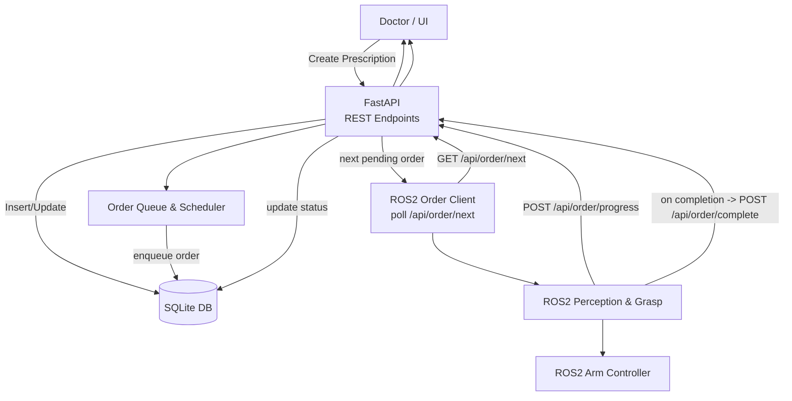

# Hospital Medicine Management System

Complete hospital medicine management system with original UI and ROS2 integration.

## Files

- `user_interface/complete_hospital_system.py` — Main app (FastAPI + embedded UI + DB)
- `user_interface/clear_database.py` — Create the clean production database

> Deprecated: `hospital_system_with_ui.py` (do not use)

## Modes

- Test mode (with sample data): `complete_hospital_medicine.db`  
- Production mode (clean, no sample): `clean_hospital_medicine.db`

## Dependencies
pip3 install fastapi uvicorn sqlalchemy pydantic requests pyyaml

## Quick Start

Test mode (sample data)
cd user_interface
python3 complete_hospital_system.py

Production mode (clean DB)
cd user_interface
python3 clear_database.py
python3 complete_hospital_system.py

## Web Interfaces

- Medicine Management: http://localhost:8001/integrated_medicine_management.html
- Doctor Interface: http://localhost:8001/doctor.html
- Prescription Management: http://localhost:8001/prescription.html

## Architecture

```mermaid
flowchart LR
  subgraph UI[Hospital Medicine Management UI]
    M[Integrated Medicine Management]
    D[Doctor Interface]
    P[Prescription Management]
  end

  subgraph API[FastAPI :8001]
    A1[/REST Endpoints/]
    A3[Order Queue & Scheduler]
    A2t[(complete_hospital_medicine.db)]
    A2p[(clean_hospital_medicine.db)]
  end

  subgraph ROS[ROS2 System]
    R1[Order Client Node<br/>(poll /api/order/next)]
    R2[Perception & Grasp]
    R3[Arm Controller]
  end

  M -->|HTTP| A1
  D -->|HTTP| A1
  P -->|HTTP| A1

  R1 <-->|GET /api/order/next| A1
  R2 -->|POST /api/order/progress| A1
  R2 -->|POST /api/order/complete| A1

  A1 <--> A3
  A3 --> A2t
  A3 --> A2p

  classDef db fill:#eef,stroke:#88a,stroke-width:1px;
  class A2t,A2p db;
```

## Processing Flow



## API Endpoints

- `GET /` — System status
- `GET /api/medicine/` — Get all medicines
- `POST /api/medicine/` — Create medicine
- `GET /api/prescription/` — Get all prescriptions
- `POST /api/prescription/` — Create prescription
- `PUT /api/prescription/{id}/status` — Update prescription status
- `GET /api/order/next` — Pull next order (ROS2)
- `POST /api/order/progress` — Report progress (ROS2)
- `POST /api/order/complete` — Report completion (ROS2)

## ROS2 Integration (three functions)

1. Pull Order — `GET /api/order/next`
   - Returns the next pending order; `204 No Content` if none.
2. Report Progress — `POST /api/order/progress`
   - Body: `order_id`, `stage`, `message`, `item`, `index`, `total`.
3. Report Completion — `POST /api/order/complete`
   - Body: `order_id`, `status`, `details`.

## YAML Order Format

order_id: "000001"
prescription_id: 1
patient_name: "John Doe"
medicine:
  - name: Aspirin
    amount: 10
    locate: [1, 1]
    prompt: tablet
  - name: Vitamin C
    amount: 5
    locate: [1, 2]
    prompt: tablet

## Reference ROS2 Polling Example

import requests
import time

BASE_URL = "http://localhost:8001"

def poll_for_orders():
    while True:
        try:
            resp = requests.get(f"{BASE_URL}/api/order/next")
            if resp.status_code == 204:
                time.sleep(3)
                continue

            order = resp.json()["order"]

            for i, med in enumerate(order["medicine"]):
                requests.post(f"{BASE_URL}/api/order/progress", json={
                    "order_id": order["order_id"],
                    "stage": "processing",
                    "message": f"Processing {med['name']}",
                    "item": med["name"],
                    "index": i + 1,
                    "total": len(order["medicine"])
                })
                time.sleep(2)

            requests.post(f"{BASE_URL}/api/order/complete", json={
                "order_id": order["order_id"],
                "status": "success",
                "details": "All medicines processed"
            })
        except Exception as e:
            print("Error:", e)
            time.sleep(5)

if __name__ == "__main__":
    poll_for_orders()
