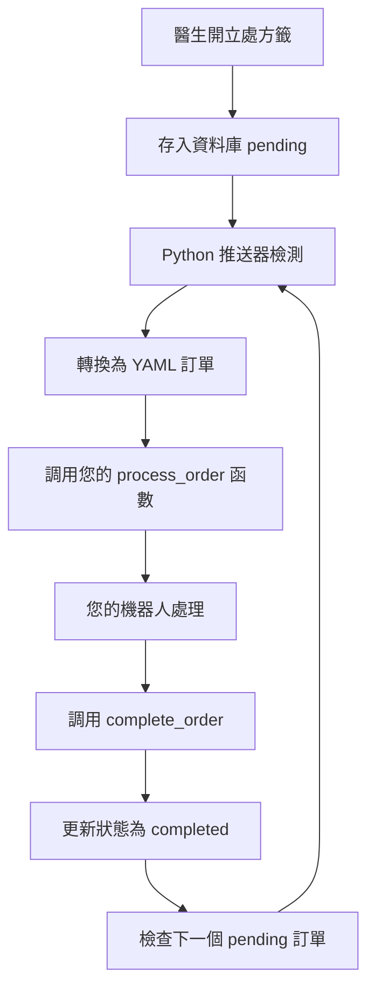
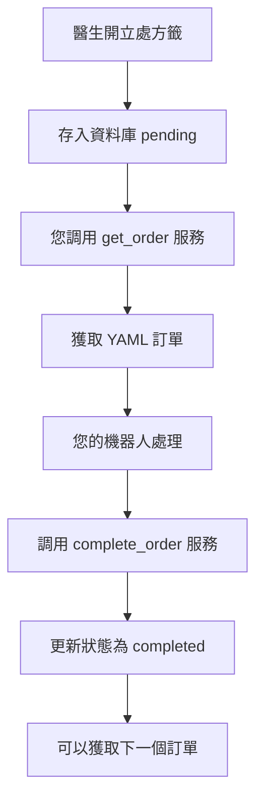

# 訂單自動推送和測試指南

## 🎯 訂單自動推送機制

### 📋 系統如何自動推送訂單

#### 1️⃣ Python 推送模式 (模式 1)
```
醫生開立處方籤 → 資料庫儲存 (status: 'pending') → 
Python 推送器監控 → 自動推送 YAML 訂單 → 您的處理函數
```

**特點：**
- ✅ **自動推送**：系統主動發送訂單到您的 Python 函數
- ✅ **一次一個**：確保單一訂單處理
- ✅ **等待完成**：必須調用 `complete_order()` 才會處理下一個

#### 2️⃣ ROS2 服務模式 (模式 2)
```
醫生開立處方籤 → 資料庫儲存 (status: 'pending' 或 'processing') → 
您的 ROS2 客戶端調用服務 → 獲取 YAML 訂單 → 處理完成後調用完成服務
```

**特點：**
- ✅ **主動獲取**：您的 ROS2 節點主動調用服務獲取訂單
- ✅ **標準 ROS2**：使用標準服務和 Topic
- ✅ **YAML 格式**：完整的 YAML 訂單格式

## 🔄 完整工作流程

### 模式 1: Python 推送模式



### 模式 2: ROS2 服務模式



## 📋 訂單格式說明

### 您會收到的 YAML 訂單格式
```yaml
order_id: "000001"
prescription_id: 1
patient_name: "張三"
medicine:
  - name: 阿斯匹靈
    amount: 10
    locate: [2, 3]
    prompt: tablet
  - name: 維他命C
    amount: 5
    locate: [1, 5]
    prompt: capsule
```

### 訂單字段說明
- **order_id**: 訂單唯一識別碼
- **prescription_id**: 處方籤 ID
- **patient_name**: 病患姓名
- **medicine**: 藥物清單
  - **name**: 藥物名稱
  - **amount**: 需要數量
  - **locate**: 藥物位置 `[row, col]`
  - **prompt**: 藥物類型 (`tablet`, `capsule`, `white_circle_box`)

## 🧪 手動測試方法

### 方法 1: 通過 Web 界面測試

#### 步驟 1: 新增測試藥物
1. 訪問：http://localhost:8001/integrated_medicine_management.html
2. 新增藥物：
   ```
   名稱: 測試藥物A
   描述: 用於測試的藥物
   庫存: 100
   ```

#### 步驟 2: 開立處方籤
1. 訪問：http://localhost:8001/doctor.html
2. 填寫處方籤：
   ```
   病患姓名: 測試病患
   選擇藥物: 測試藥物A
   數量: 5
   ```
3. 點擊「開立處方籤」

#### 步驟 3: 觀察自動推送
- **模式 1**: 查看終端機，會看到自動推送的 YAML 訂單
- **模式 2**: 您的 ROS2 客戶端會收到新訂單

### 方法 2: 直接 API 測試

#### 創建測試處方籤
```bash
curl -X POST "http://localhost:8001/api/prescription/" \
-H "Content-Type: application/json" \
-d '{
  "patient_name": "API測試病患",
  "medicines": [
    {
      "name": "測試藥物A",
      "amount": 3
    }
  ]
}'
```

#### 檢查處方籤狀態
```bash
curl "http://localhost:8001/api/prescription/"
```

### 方法 3: 批量測試腳本

創建 `test_order_flow.py`：
```python
#!/usr/bin/env python3
import requests
import time
import json

def create_test_prescription(patient_name, medicine_name, amount):
    """創建測試處方籤"""
    url = "http://localhost:8001/api/prescription/"
    data = {
        "patient_name": patient_name,
        "medicines": [
            {
                "name": medicine_name,
                "amount": amount
            }
        ]
    }
    
    response = requests.post(url, json=data)
    if response.status_code == 200:
        result = response.json()
        print(f"✅ 創建處方籤成功: ID {result.get('id')}")
        return result.get('id')
    else:
        print(f"❌ 創建處方籤失敗: {response.status_code}")
        return None

def check_prescription_status(prescription_id):
    """檢查處方籤狀態"""
    url = f"http://localhost:8001/api/prescription/{prescription_id}"
    response = requests.get(url)
    if response.status_code == 200:
        data = response.json()
        status = data.get('status', 'unknown')
        print(f"📋 處方籤 {prescription_id} 狀態: {status}")
        return status
    else:
        print(f"❌ 查詢狀態失敗: {response.status_code}")
        return None

def main():
    """測試訂單流程"""
    print("🧪 開始測試訂單流程...")
    
    # 創建測試處方籤
    prescription_id = create_test_prescription(
        patient_name="自動測試病患",
        medicine_name="測試藥物",
        amount=2
    )
    
    if prescription_id:
        # 監控狀態變化
        for i in range(10):
            status = check_prescription_status(prescription_id)
            if status == 'completed':
                print("✅ 訂單已完成!")
                break
            elif status == 'processing':
                print("🔄 訂單處理中...")
            time.sleep(3)
        else:
            print("⏰ 測試超時，可能需要手動完成")

if __name__ == "__main__":
    main()
```

## 🔧 手動完成訂單的方法

### 模式 1: Python 推送模式

在您的處理函數中：
```python
def your_process_order(order_dict, yaml_order):
    order_id = order_dict['order_id']
    
    # 您的處理邏輯
    print(f"處理訂單: {order_id}")
    
    # 重要：完成後必須調用
    if hasattr(self, '_order_pusher') and self._order_pusher:
        success = self._order_pusher.complete_order(order_id)
        if success:
            print(f"✅ 訂單 {order_id} 已完成")
```

### 模式 2: ROS2 服務模式

#### 獲取訂單
```bash
ros2 service call /hospital/get_order std_srvs/srv/Empty
```

#### 監聽訂單數據
```bash
ros2 topic echo /hospital/order_data
```

#### 完成訂單
```bash
ros2 service call /hospital/complete_order std_srvs/srv/Empty
```

#### Python 代碼示例
```python
import rclpy
from rclpy.node import Node
from std_srvs.srv import Empty
from std_msgs.msg import String
import yaml

class OrderHandler(Node):
    def __init__(self):
        super().__init__('order_handler')
        
        # 服務客戶端
        self.get_order_client = self.create_client(Empty, 'hospital/get_order')
        self.complete_order_client = self.create_client(Empty, 'hospital/complete_order')
        
        # 訂閱訂單數據
        self.order_sub = self.create_subscription(
            String, 'hospital/order_data', self.order_callback, 10)
        
        self.current_order = None
    
    def get_new_order(self):
        """獲取新訂單"""
        request = Empty.Request()
        future = self.get_order_client.call_async(request)
        rclpy.spin_until_future_complete(self, future)
        
    def order_callback(self, msg):
        """處理收到的訂單"""
        try:
            order_data = yaml.safe_load(msg.data)
            self.current_order = order_data
            
            print(f"📋 收到訂單: {order_data['order_id']}")
            
            # 處理訂單邏輯
            self.process_order(order_data)
            
            # 完成訂單
            self.complete_current_order()
            
        except Exception as e:
            print(f"❌ 處理訂單錯誤: {e}")
    
    def process_order(self, order_data):
        """您的訂單處理邏輯"""
        medicines = order_data.get('medicine', [])
        
        for med in medicines:
            name = med['name']
            amount = med['amount']
            locate = med['locate']
            prompt = med['prompt']
            
            print(f"🤖 處理藥物: {name} x{amount} at {locate} ({prompt})")
            # 您的機器人邏輯
            
    def complete_current_order(self):
        """完成當前訂單"""
        if self.current_order:
            order_id = self.current_order['order_id']
            print(f"✅ 完成訂單: {order_id}")
            
            request = Empty.Request()
            future = self.complete_order_client.call_async(request)
            rclpy.spin_until_future_complete(self, future)
            
            self.current_order = None

def main():
    rclpy.init()
    handler = OrderHandler()
    
    # 自動獲取訂單
    handler.get_new_order()
    
    rclpy.spin(handler)
    
    handler.destroy_node()
    rclpy.shutdown()

if __name__ == '__main__':
    main()
```

## 🔍 監控和調試

### 檢查系統狀態
```bash
# 檢查處方籤列表
curl "http://localhost:8001/api/prescription/"

# 檢查系統狀態
curl "http://localhost:8001/api/system/status"

# 檢查 ROS2 服務狀態
curl "http://localhost:8001/api/ros2/service-status"
```

### 查看處方籤管理界面
訪問：http://localhost:8001/Prescription.html
- 可以看到所有處方籤的狀態
- 手動更新狀態
- 監控處理進度

### 調試技巧

#### 1. 檢查處方籤狀態變化
```bash
# 持續監控處方籤狀態
watch -n 2 "curl -s http://localhost:8001/api/prescription/ | jq '.[] | {id, status, patient_name}'"
```

#### 2. 手動更新處方籤狀態
```bash
# 將處方籤標記為完成
curl -X PUT "http://localhost:8001/api/prescription/1/status" \
-H "Content-Type: application/json" \
-d '{"status": "completed"}'
```

#### 3. 重置處方籤狀態進行重測
```bash
# 重置為 pending 狀態
curl -X PUT "http://localhost:8001/api/prescription/1/status" \
-H "Content-Type: application/json" \
-d '{"status": "pending"}'
```

## 🎯 總結

### 自動推送特點
- ✅ **模式 1**: 系統主動推送到您的 Python 函數
- ✅ **模式 2**: 您主動調用 ROS2 服務獲取
- ✅ **一次一個**: 兩種模式都確保單一訂單處理
- ✅ **等待完成**: 必須調用完成函數才會處理下一個

### 測試建議
1. **先用 Web 界面**測試基本流程
2. **使用 API**進行自動化測試
3. **監控狀態變化**確保正確流程
4. **手動完成訂單**驗證完成機制

**現在您可以完全掌控訂單的自動推送和手動測試流程！** 🎊