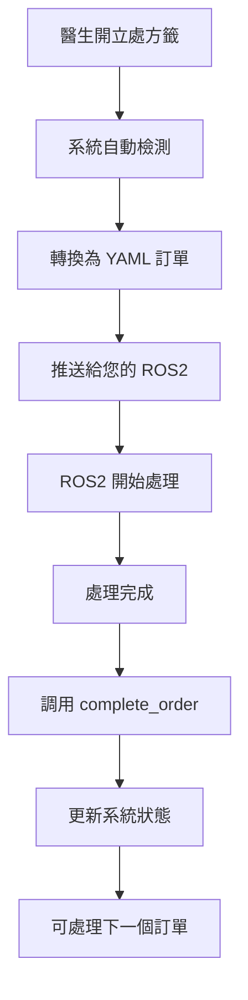

# 醫院藥物管理系統 - 最終完整版

## 🎯 系統概述

這是一個完整的醫院藥物管理系統，支援 Web 界面操作和 ROS2 自動化整合。系統會**主動推送訂單**給您的 ROS2 系統，並且**一次只處理一個訂單**，等待您的 ROS2 完成後才處理下一個。

## ✅ 系統特點

- ✅ **完全乾淨** - 無任何測試資料
- ✅ **自動推送** - 無需手動查詢，系統主動發送訂單
- ✅ **單一處理** - 一次只處理一個訂單，確保 ROS2 不會過載
- ✅ **狀態同步** - ROS2 完成後自動更新系統狀態
- ✅ **YAML 格式** - 訂單採用您指定的格式

## 📁 核心文件

```
📦 醫院藥物管理系統/
├── 🚀 start_complete_system.py        # 一鍵啟動完整系統
├── 🌐 simple_server_final.py          # Web 服務器
├── 🤖 ros2_order_pusher.py           # 訂單推送器
├── 🔧 integration_example.py         # ROS2 整合示例
├── 💾 database_final.py              # 數據庫配置
├── 💾 hospital_medicine_final.db     # 數據庫文件
├── 📖 WEB_ROS2_ARCHITECTURE.md       # 架構圖說明
├── 📖 FINAL_SYSTEM_GUIDE.md          # 詳細使用說明
└── 📁 static/                        # 網頁文件
    ├── integrated_medicine_management.html
    ├── doctor.html
    ├── Prescription.html
    ├── ros2_client.html
    └── css/, js/
├── 🤖 ros2_services_interface.py     # ROS2 服務節點
├── 🤖 ros2_client_example.py        # ROS2 客戶端示例
├── 📖 ROS2_SERVICES_GUIDE.md        # ROS2 服務使用指南
```

## 🚀 快速啟動

### 一鍵啟動完整系統
```bash
cd /workspace/user_interface
python3 start_complete_system.py
```

這會同時啟動：
- Web 服務器 (port 8001)
- ROS2 訂單推送器
- 系統狀態監控

## 🌐 網頁界面

| 功能 | 網址 | 用途 |
|------|------|------|
| 藥物管理 | http://localhost:8001/integrated_medicine_management.html | 新增、管理藥物 |
| 醫生工作台 | http://localhost:8001/doctor.html | 開立處方籤 |
| 處方籤管理 | http://localhost:8001/Prescription.html | 查看處方籤狀態 |
| ROS2 客戶端 | http://localhost:8001/ros2_client.html | 手動測試 ROS2 功能 |
| API 文檔 | http://localhost:8001/docs | FastAPI 自動文檔 |

## 🔄 工作流程



## 📄 訂單格式

您的 ROS2 系統會收到這樣的訂單：

```yaml
order_id: "000001"
medicine:
  - name: Antipsychotics
    amount: 87
    locate: [9, 6]
    prompt: white_circle_box
  - name: 測試藥物B
    amount: 212
    locate: [1, 3]
    prompt: tablet
```

## 🔧 整合您的 ROS2 系統

### 方法 1: Python 模組整合
編輯 `integration_example.py` 中的 `YourROS2System` 類：

```python
class YourROS2System:
    def process_order(self, order_dict, yaml_order):
        """處理訂單的主要函數"""
        order_id = order_dict['order_id']
        medicines = order_dict['medicines']
        
        # 替換為您的 ROS2 邏輯
        for medicine in medicines:
            name = medicine['name']
            amount = medicine['amount']
            locate = medicine['locate']  # [row, col]
            prompt = medicine['prompt']  # 藥物類型
            
            # 您的 ROS2 處理邏輯
            your_ros2_node.navigate_to(locate)
            your_ros2_node.pick_medicine(name, amount, prompt)
            your_ros2_node.deliver()
        
        # 重要：完成後通知系統
        global order_pusher
        order_pusher.complete_order(order_id)
```

### 方法 2: ROS2 服務接口
使用 ROS2 標準服務和 Topic 與系統通信：

```bash
# 啟動 ROS2 服務節點
python3 ros2_services_interface.py

# 啟動您的 ROS2 客戶端
python3 ros2_client_example.py
```

詳細說明請參考：[ROS2_SERVICES_GUIDE.md](ROS2_SERVICES_GUIDE.md)

### 關鍵函數和服務
- `pusher.complete_order(order_id)` - **必須**在 ROS2 完成後調用
- `pusher.get_status()` - 獲取當前系統狀態
- `pusher.is_ros2_busy()` - 檢查是否正在處理訂單
- ROS2 服務: `/hospital/get_order`, `/hospital/complete_order`
- ROS2 Topic: `/hospital/order_data`, `/hospital/medicine_request`

## 🧪 測試流程

1. **啟動系統**：
   ```bash
   python3 start_complete_system.py
   ```

2. **新增藥物**：
   - 訪問：http://localhost:8001/integrated_medicine_management.html
   - 新增一些測試藥物

3. **開立處方籤**：
   - 訪問：http://localhost:8001/doctor.html
   - 選擇藥物，開立處方籤

4. **觀察自動推送**：
   - 查看終端機輸出
   - 系統會自動檢測新處方籤
   - 轉換為 YAML 格式推送

5. **檢查狀態**：
   - 訪問：http://localhost:8001/Prescription.html
   - 查看處方籤狀態變化

## 📊 系統架構

詳細架構說明請參考：[WEB_ROS2_ARCHITECTURE.md](WEB_ROS2_ARCHITECTURE.md)

## 🎯 重要特性

### 單一訂單處理
- 系統確保一次只處理一個訂單
- 如果 ROS2 正忙，新訂單會等待
- 只有在調用 `complete_order()` 後才會處理下一個

### 自動狀態同步
- 處方籤狀態會自動更新：pending → processing → completed
- Web 界面會即時反映處理進度
- 不需要手動管理狀態

### 錯誤處理
- 系統會自動處理異常情況
- 錯誤時會重置狀態，允許繼續處理
- 完整的日誌記錄

## 🛠️ 自定義配置

### 修改檢查間隔
```python
pusher.check_interval = 5  # 改為 5 秒檢查一次
```

### 修改藥物位置算法
編輯 `ros2_order_pusher.py` 中的 `_get_medicine_location` 方法

### 修改藥物類型識別
編輯 `ros2_order_pusher.py` 中的 `_get_medicine_prompt` 方法

## 📞 技術支援

如果遇到問題：

1. 檢查系統狀態：http://localhost:8001/api/system/status
2. 查看終端機日誌輸出
3. 確認 8001 端口未被占用
4. 參考 `FINAL_SYSTEM_GUIDE.md` 詳細說明

## 🎉 總結

這個系統完全滿足您的需求：

- ✅ **主動推送訂單**而不是被動查詢
- ✅ **一次處理一個**，等待 ROS2 完成
- ✅ **YAML 格式**輸出，包含位置和類型資訊
- ✅ **完全乾淨**，無測試資料
- ✅ **功能完整**，包含所有必要 API

**系統已準備就緒，可以開始與您的 ROS2 系統整合！** 🚀