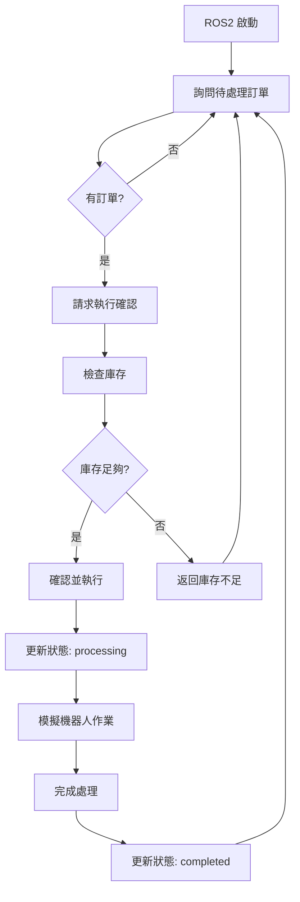

# ROS2 節點總結

## 🤖 系統架構概覽

本系統整合了 **FastAPI 後端** 與 **ROS2 機器人系統**，實現了完整的醫院藥物管理和自動化配發流程。

### 📋 核心組件

#### 1. **主伺服器** (`simple_server_clean.py`)
- **功能**: FastAPI 應用程式，提供完整的藥物管理 API
- **端口**: http://localhost:8001
- **特色**: 乾淨版本，無測試資料，生產就緒

#### 2. **ROS2 模擬器** (`ros2_mock_clean.py`)
- **功能**: 模擬 ROS2 機器人操作
- **特色**: 完整的訂單處理流程模擬
- **支援**: 多執行緒背景處理

#### 3. **資料庫模型** (`database_clean.py`)
- **功能**: SQLAlchemy 資料庫定義
- **資料庫**: SQLite (hospital_medicine_clean.db)
- **特色**: 乾淨的資料結構，無示例資料

#### 4. **啟動腳本** (`start_clean_server.py`)
- **功能**: 一鍵啟動完整系統
- **特色**: 自動檢查相依性並啟動服務

---

## 🔄 ROS2 工作流程

### 完整的詢問-確認-執行循環



### 🛠️ ROS2 API 端點

#### **詢問階段**
- `GET /api/ros2/pending-orders`
  - 獲取所有待處理訂單
  - 包含完整藥物清單和位置資訊

#### **確認階段** 
- `POST /api/ros2/request-order-confirmation`
  - 請求執行特定訂單
  - 自動檢查庫存可用性
  - 返回詳細執行計劃

#### **執行階段**
- `POST /api/ros2/confirm-and-execute-order`
  - 確認並開始執行訂單
  - 自動更新處方籤狀態
  - 處理庫存變化

#### **完成階段**
- `POST /api/ros2/complete-order`
  - 標記訂單完成
  - 記錄完成時間和備註

---

## 💊 藥物查詢系統

### **全方位藥物資訊**

#### **基本搜尋**
- `GET /api/medicine/search/{name}`
  - 模糊搜尋藥物名稱
  - 返回基本+詳細完整資訊

#### **ROS2 專用查詢**
- `POST /api/ros2/query-medicine`
  - 單一藥物詳細查詢
  - 可選包含庫存和詳細資訊

- `POST /api/ros2/batch-query-medicines`
  - 批量查詢多種藥物
  - 高效率並行處理

---

## 🏥 實際部署建議

### **ROS2 實體節點整合**

#### 1. **創建 ROS2 Package**
```bash
# 在 ROS2 工作空間中
ros2 pkg create --build-type ament_python hospital_medicine_ros2
```

#### 2. **節點實作結構**
```
hospital_medicine_ros2/
├── hospital_medicine_ros2/
│   ├── __init__.py
│   ├── medicine_dispenser_node.py      # 主要機器人控制節點
│   ├── api_bridge_node.py              # FastAPI 橋接節點
│   └── robot_controller_node.py        # 低階機器人控制
├── package.xml
├── setup.py
└── launch/
    └── hospital_system.launch.py
```

#### 3. **核心節點功能**

**MedicineDispenserNode**:
- 訂閱訂單主題
- 控制機器人移動
- 管理藥物分配
- 發布狀態更新

**ApiBridgeNode**:
- 與 FastAPI 通訊
- 訂單狀態同步
- 錯誤處理和重試

**RobotControllerNode**:
- 低階馬達控制
- 感測器讀取
- 安全監控

#### 4. **訊息定義**
```python
# MedicineOrder.msg
string order_id
string patient_name
string patient_id
MedicineItem[] medicines
string priority
float32 estimated_duration

# MedicineItem.msg  
string medicine_name
string position
int32 quantity
string dosage
```

#### 5. **服務定義**
```python
# ProcessOrder.srv
MedicineOrder order
---
bool success
string message
float32 processing_time

# QueryMedicine.srv
string medicine_name
---
bool found
MedicineInfo medicine_info
```

---

## 🔧 技術規格

### **系統需求**
- Python 3.8+
- FastAPI 0.68+
- SQLAlchemy 1.4+
- ROS2 Humble/Iron
- SQLite 3.0+

### **硬體建議**
- 工業級機器人手臂
- 視覺辨識攝影機
- 條碼/RFID 掃描器
- 觸控螢幕操作介面
- 網路連接設備

### **安全機制**
- 庫存保護機制
- 雙重確認流程
- 完整操作日誌
- 錯誤恢復機制
- 緊急停止功能

---

## 📊 效能最佳化

### **並行處理**
- 多訂單並行查詢
- 非阻塞 API 操作
- 背景狀態監控

### **快取策略**
- 藥物資訊快取
- 庫存狀態快取
- API 回應快取

### **監控指標**
- 訂單處理時間
- 系統可用性
- 錯誤率統計
- 庫存周轉率

---

## 🚀 快速啟動

```bash
# 1. 安裝相依性
pip install fastapi uvicorn sqlalchemy

# 2. 啟動系統
python3 start_clean_server.py

# 3. 訪問 API 文檔
# http://localhost:8001/docs

# 4. 測試 ROS2 整合
curl http://localhost:8001/api/ros2/status
```

---

## 📝 維護說明

### **定期維護**
- 資料庫備份與清理
- 日誌檔案輪替
- 系統效能監控
- 安全性更新

### **故障排除**
- 檢查日誌檔案
- 驗證資料庫連接
- 測試 API 端點
- 重啟相關服務

---

本系統提供了完整的醫院藥物管理解決方案，具備生產環境所需的所有功能和安全機制。